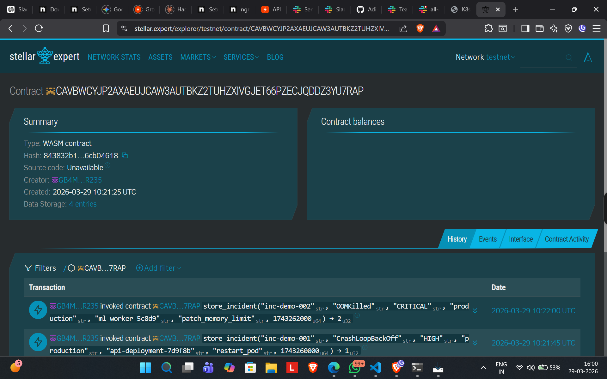
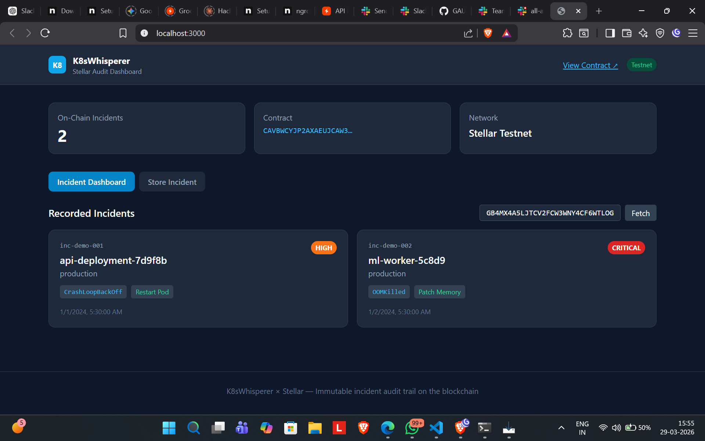

# K8sWhisperer -- Immutable Incident Audit on Stellar

## Project Description

We built K8sWhisperer, an autonomous Kubernetes incident response agent that detects cluster anomalies (CrashLoopBackOff, OOMKilled, Pending, etc.), diagnoses root causes, and executes fixes automatically. The problem? Audit logs on a mutable server can be silently altered after the fact. If the agent restarts a pod or patches a deployment, there needs to be a record no one can tamper with.

This Stellar integration solves that. Every incident the agent handles -- what broke, why, what action was taken, and the outcome -- gets written to a Soroban smart contract on Stellar's testnet. The record is permanent. Even the agent itself can't go back and change it.

## Project Vision

On-call incidents are stressful. When the post-mortem happens the next day, everyone asks: "what exactly did the agent do at 3am?" With mutable logs, you're trusting that nobody cleaned up embarrassing entries. With blockchain-backed audit, the answer is cryptographically verifiable. We're building towards a world where autonomous DevOps agents are held accountable by immutable records -- not just internal log files.

## Key Features

- Soroban smart contract with `store_incident`, `get_incident`, and `get_count` functions storing structured records (not just hashes)
- React + Tailwind dashboard that reads incidents directly from the deployed contract via Stellar SDK
- Store Incident form that lets you submit incidents from the browser with secret key signing
- Python integration hook (`stellar_hook.py`) that automatically pushes incidents from the K8sWhisperer pipeline to the blockchain
- Live feed from the K8sWhisperer agent -- dashboard auto-fetches new incidents every 10 seconds
- Block explorer links on every card for independent verification on stellar.expert
- Supports all 8 anomaly types: CrashLoopBackOff, OOMKilled, Pending, ImagePullBackOff, Evicted, CPUThrottling, DeploymentStalled, NodeNotReady
- Pipeline visualization showing the 7-stage flow ending with the Stellar audit stage

## Deployed Smartcontract Details

**Contract ID:**
```
CAVBWCYJP2AXAEUJCAW3AUTBKZ2TUHZXIVGJET66PZECJQDDZ3YU7RAP
```

**Network:** Stellar Testnet

**Block Explorer (contract):**
https://stellar.expert/explorer/testnet/contract/CAVBWCYJP2AXAEUJCAW3AUTBKZ2TUHZXIVGJET66PZECJQDDZ3YU7RAP

**Deployment transaction:**
https://stellar.expert/explorer/testnet/tx/345322b2c046894942126b4665f408259dc6476af1e3c5bf9d1269ffcf82e05b

**Incidents stored on-chain (sample transactions):**

| Incident | TX Hash | Explorer Link |
|----------|---------|---------------|
| First incident | `51a62be7...` | [View on Stellar](https://stellar.expert/explorer/testnet/tx/51a62be7ebc0577b22ad705ffd084a5d473793a6c44cc13d04c61eaebb3ba85c) |
| Second incident | `d63ed94d...` | [View on Stellar](https://stellar.expert/explorer/testnet/tx/d63ed94d0a069572f7afcb2a6588ad5a2ebd70fb64ef58f046c9ec6361f8ea89) |
| SDK fix test | `de96c25f...` | [View on Stellar](https://stellar.expert/explorer/testnet/tx/de96c25f1f1244eb6c27b9dff71f26df0dd81cea2b1f86280a1937af76971eda) |
| OOMKilled live demo | `a929e14b...` | [View on Stellar](https://stellar.expert/explorer/testnet/tx/a929e14b7578eb6800c85c1f95cca1dfd21e59dc839c5a238fa1683955086dc3) |

Screenshot of the block explorer showing the deployed contract:



## UI Screenshots

### Incident Dashboard
The dashboard shows all incidents detected by the K8sWhisperer agent, with severity badges, action labels, execution status, and block explorer links.



### Store Incident Form
Engineers can manually submit incident records to the blockchain for cases the agent didn't handle automatically.

*(Store form is accessible via the "Store Incident" tab in the dashboard)*

## Project Setup Guide

### Prerequisites
- Node.js 18+
- Rust + `wasm32-unknown-unknown` target (only if rebuilding the contract)
- Stellar CLI (only if deploying your own contract)

### 1. Install frontend
```bash
cd stellar/
npm install
```

### 2. Configure environment
```bash
cp .env.example .env
# Already contains the deployed contract ID and public key
```

### 3. Start the dashboard
```bash
npm start
# Opens at http://localhost:3000
```

The dashboard auto-connects to the K8sWhisperer agent at `localhost:9000` and pulls incidents in real-time. It also reads incident count directly from the Stellar contract.

### 4. Run the Python integration hook (standalone)
```bash
pip install stellar-sdk
export STELLAR_SECRET_KEY=S...your_key...
export STELLAR_CONTRACT_ID=CAVBWCYJP2AXAEUJCAW3AUTBKZ2TUHZXIVGJET66PZECJQDDZ3YU7RAP
python stellar_hook.py
```

When K8sWhisperer runs with `STELLAR_SECRET_KEY` set in `.env`, incidents are automatically submitted to the blockchain after every pipeline cycle -- no manual steps needed.

### 5. (Optional) Rebuild the smart contract
```bash
cd contracts/incident-audit/
cargo build --target wasm32-unknown-unknown --release
```

### 6. (Optional) Deploy your own contract
```bash
stellar keys generate mykey --network testnet
stellar contract deploy \
  --wasm contracts/incident-audit/target/wasm32-unknown-unknown/release/incident_audit.wasm \
  --source mykey \
  --network testnet
```

## Integration Logic

The integration between the frontend and the Soroban contract is in `src/stellar.js`. It uses `@stellar/stellar-sdk` to:

- **`getIncidentCount()`** -- Simulates a `get_count` call on the contract to read total incidents stored
- **`getIncident(id, publicKey)`** -- Simulates a `get_incident` call to retrieve a specific record by ID
- **`storeIncident(secretKey, incident)`** -- Builds, signs, and submits a `store_incident` transaction

The Python hook (`stellar_hook.py`) uses `stellar-sdk` (Python) to do the same from the backend, building `SCVal` parameters with XDR types for the contract call.

Both paths hit the same deployed contract on Stellar testnet.

## Future Scope

- Hook the blockchain submission deeper into the K8sWhisperer pipeline so it fires before the audit log write (currently fires after, in a background thread)
- Add Stellar Passkey login so engineers can verify incidents without managing raw secret keys
- Build a multi-cluster view that aggregates incidents from multiple Kubernetes deployments into one blockchain dashboard
- Use Stellar's multi-sig for HITL approval -- require 2-of-3 team signatures before high blast-radius remediations execute on-chain
- Add incident severity trending and SLA tracking directly from on-chain data
